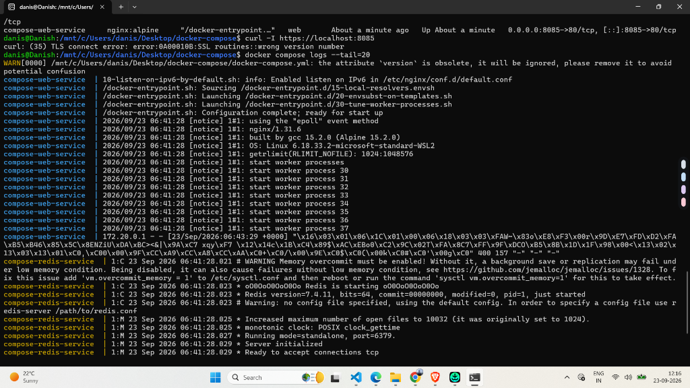
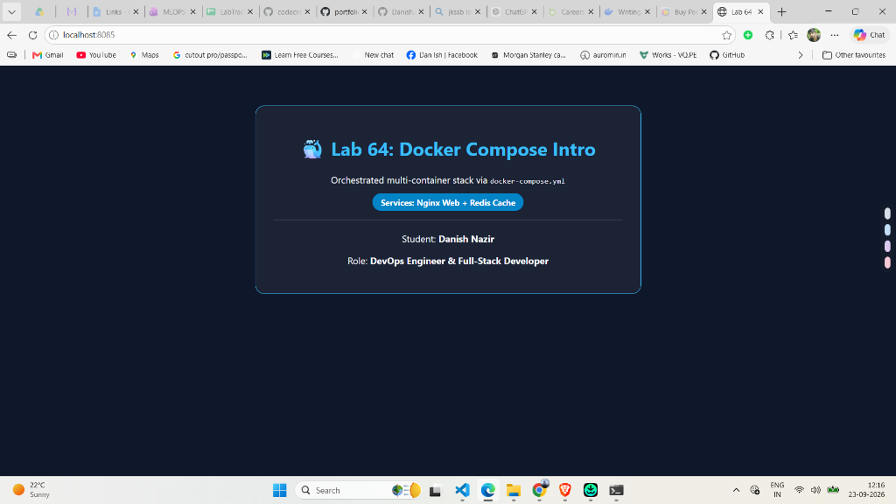

# Lab 64: Docker Compose Introduction

## 📌 Lab Overview & Real-World DevOps Context

In previous containerization labs, launching a multi-service application required executing multiple manual `docker run`, `docker network create`, and `docker volume create` commands in a strict sequence. In production, managing microservices with manual terminal commands introduces human error, configuration drift, and unmanageable operational overhead.

**Docker Compose** solves this by providing a declarative **Infrastructure-as-Code (IaC)** specification. Using a single `docker-compose.yml` file, developers and DevOps engineers can define:
- Multiple interconnected service containers
- Port forwardings and exposed interfaces
- Host bind mounts and persistent volume allocations
- Project-isolated bridge networks with automatic DNS service discovery
- Startup dependencies (`depends_on`) and restart policies

In **Lab 64**, we orchestrate our first multi-container stack combining a high-performance **Nginx web server** and a **Redis in-memory caching database** managed under a single unified lifecycle.

---

## 🏗️ Multi-Container Architecture

```text
                           [ Client Browser / cURL ]
                                      │
                               Port 8085 : 80 (HTTP)
                                      ▼
┌────────────────────────────────────────────────────────────────────────┐
│  Docker Compose Project: docker-compose                                │
│                                                                        │
│  ┌──────────────────────────────┐      ┌────────────────────────────┐  │
│  │ Service: web                 │      │ Service: redis             │  │
│  │ Image: nginx:alpine          │      │ Image: redis:7-alpine      │  │
│  │ Container: compose-web-serv… │      │ Container: compose-redis-… │  │
│  │ Port: 8085:80                │      │ Port: 6379:6379            │  │
│  │ Mount: ./index.html          │      │ In-Memory Cache            │  │
│  └──────────────┬───────────────┘      └─────────────┬──────────────┘  │
│                 │                                    │                 │
│                 └─────────────────┬──────────────────┘                 │
│                                   ▼                                    │
│                 ┌───────────────────────────────────┐                  │
│                 │  Network: app-network (Bridge)    │                  │
│                 │  DNS: resolve 'web' & 'redis'     │                  │
│                 └───────────────────────────────────┘                  │
└────────────────────────────────────────────────────────────────────────┘
```

---

## 📝 Step-by-Step Implementation

### Step 1: Create Custom Application Page (`index.html`)

We created a custom landing page served by Nginx to verify that our web service successfully delivers content and reflects Danish's DevOps profile:

```html
<!DOCTYPE html>
<html lang="en">
<head>
    <meta charset="UTF-8">
    <title>Lab 64 - Docker Compose Intro</title>
    <style>
        body { font-family: 'Segoe UI', sans-serif; background: #0f172a; color: #f8fafc; text-align: center; padding-top: 60px; }
        .card { background: rgba(255,255,255,0.05); border: 1px solid #38bdf8; max-width: 600px; margin: auto; padding: 30px; border-radius: 16px; }
        h1 { color: #38bdf8; }
        .badge { background: #0284c7; color: white; padding: 6px 14px; border-radius: 20px; font-size: 14px; font-weight: bold; }
    </style>
</head>
<body>
    <div class="card">
        <h1>🐳 Lab 64: Docker Compose Intro</h1>
        <p>Orchestrated multi-container stack via <code>docker-compose.yml</code></p>
        <p><span class="badge">Services: Nginx Web + Redis Cache</span></p>
        <hr style="border: 0.5px solid rgba(255,255,255,0.1); margin: 20px 0;">
        <p>Student: <b>Danish Nazir</b></p>
        <p>Role: <b>DevOps Engineer &amp; Full-Stack Developer</b></p>
    </div>
</body>
</html>
```

---

### Step 2: Define `docker-compose.yml`

We authored the declarative compose file defining two services (`web` and `redis`) sharing a user-defined bridge network:

```yaml
version: '3.8'

services:
  # Service 1: Nginx Web Server
  web:
    image: nginx:alpine
    container_name: compose-web-service
    ports:
      - "8085:80"
    volumes:
      - ./index.html:/usr/share/nginx/html/index.html:ro
    restart: always
    networks:
      - app-network
    depends_on:
      - redis

  # Service 2: Redis In-Memory Cache
  redis:
    image: redis:7-alpine
    container_name: compose-redis-service
    ports:
      - "6379:6379"
    restart: always
    networks:
      - app-network

networks:
  app-network:
    driver: bridge
```

#### Key Directives Explained:
- **`services`**: Defines the compute workloads to instantiate as containers.
- **`image`**: Specifies the base container image from Docker Hub (`nginx:alpine` and `redis:7-alpine`).
- **`ports`**: Exposes host port `8085` routed to container port `80` (HTTP) and port `6379` for Redis.
- **`volumes`**: Mounts `index.html` from the local directory into Nginx's DocumentRoot in read-only (`:ro`) mode.
- **`depends_on`**: Declares startup ordering—ensures Redis initializes before Nginx begins listening.
- **`networks`**: Connects both containers to `app-network`, enabling automated DNS hostname resolution between services.

---

### Step 3: Validate Compose Specification

Before launching, we validated the YAML syntax and resolved variables using the Docker Compose configuration engine:

```bash
docker compose config
```

---

### Step 4: Deploy Multi-Container Stack

We deployed both containers in detached background mode with a single command:

```bash
docker compose up -d
```

**Terminal Execution Output:**
```text
[+] Running 3/3
 ✔ Network docker-compose_app-network  Created
 ✔ Container compose-redis-service     Started
 ✔ Container compose-web-service       Started
```

---

### Step 5: Verification & Inspection

#### 1. Container Process State (`docker compose ps`)
```bash
docker compose ps
```
```text
NAME                    IMAGE            COMMAND                  SERVICE   CREATED          STATUS          PORTS
compose-redis-service   redis:7-alpine   "docker-entrypoint.s…"   redis     About a minute   Up 1 minute     0.0.0.0:6379->6379/tcp
compose-web-service     nginx:alpine     "/docker-entrypoint.…"   web       About a minute   Up 1 minute     0.0.0.0:8085->80/tcp
```

#### 2. Aggregated Multi-Service Logs (`docker compose logs`)
Docker Compose aggregates standard output from all services into a unified, color-coded stream:

```bash
docker compose logs --tail=20
```



#### 3. HTTP Header Verification
Testing the web server endpoint using `curl`:

```bash
curl -I http://localhost:8085
```

```text
HTTP/1.1 200 OK
Server: nginx/1.31.6
Date: Wed, 23 Sep 2026 06:46:42 GMT
Content-Type: text/html
Content-Length: 1054
Connection: keep-alive
ETag: "6ab3728d-41e"
Accept-Ranges: bytes
```

> [!NOTE]
> Testing via `https://localhost:8085` initially produced `curl: (35) TLS connect error: wrong version number` because port 8085 forwards to standard HTTP (port 80) rather than an SSL/TLS HTTPS port (port 443). Querying `http://localhost:8085` verified full HTTP/1.1 200 OK operation.

#### 4. Live Browser Verification
Navigating to `http://localhost:8085` in Google Chrome confirms the rendered multi-container application:



---

## ⚡ Essential Docker Compose CLI Reference

| Command | Action |
| :--- | :--- |
| `docker compose up -d` | Create and launch all containers, networks, and volumes in background |
| `docker compose ps` | View the live state and port bindings of all services in the stack |
| `docker compose logs -f` | Follow live aggregated logs across all running containers |
| `docker compose stop` | Pause running containers without removing networks or container states |
| `docker compose restart` | Restart all active service containers |
| `docker compose down` | Stop and remove all containers and network interfaces cleanly |
| `docker compose down -v` | Stop containers, remove networks, and destroy named volumes |

---

## 💡 Key Takeaways & DevOps Best Practices

1. **Declarative vs. Imperative**: Instead of executing imperative `docker run` scripts, Docker Compose uses declarative YAML files that serve as self-documenting Infrastructure-as-Code.
2. **Automated Project Isolation**: Compose automatically prefixes networks and volume names with the project directory name, preventing naming collisions across projects.
3. **Internal Service DNS**: Containers on the same compose network communicate using service names (e.g. `web` can ping `redis` on port `6379` directly).
4. **Reproducibility**: Developers and CI/CD pipelines can clone this repository and spin up identical environments with a single `docker compose up -d` command.
